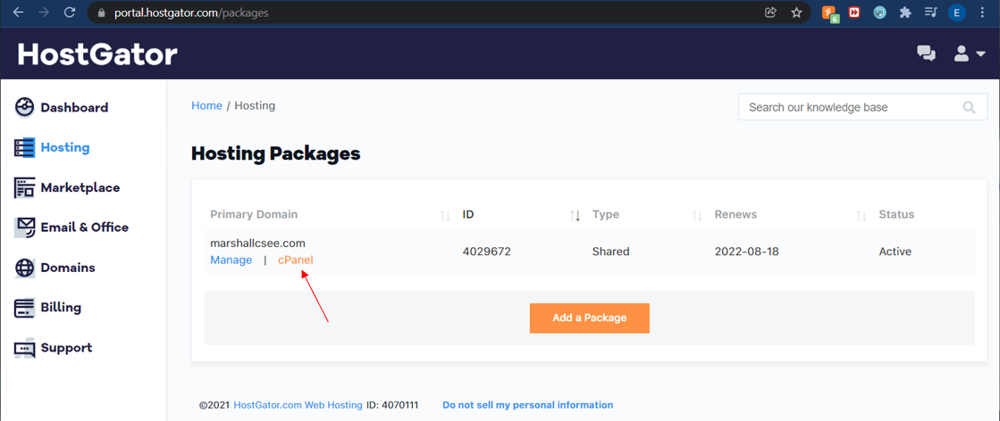
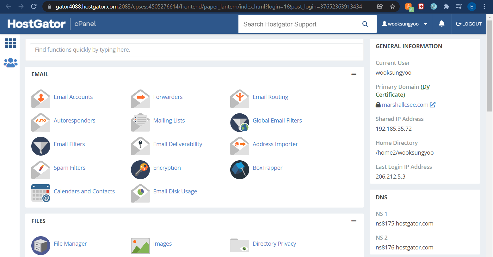
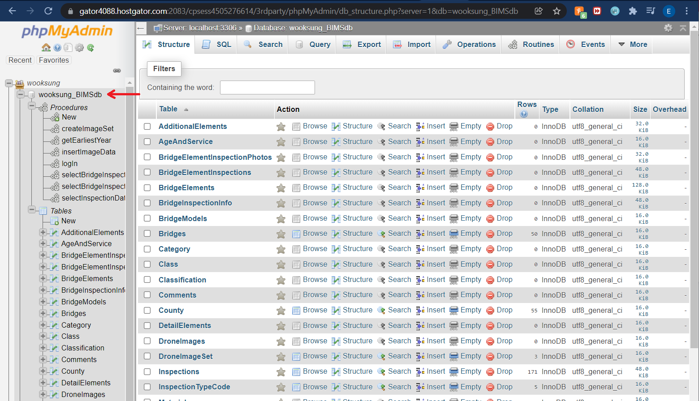
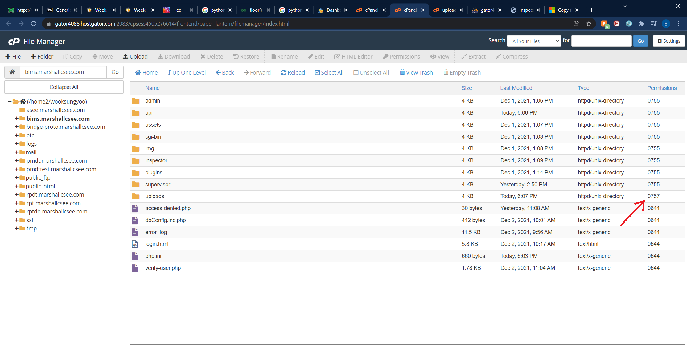
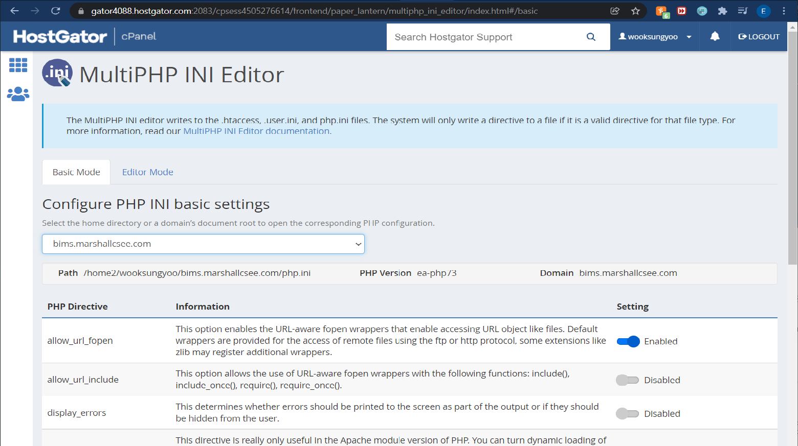
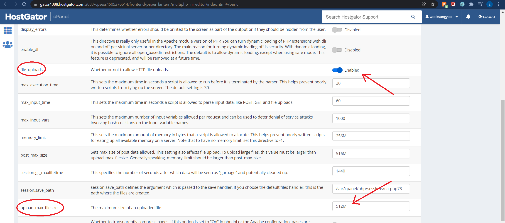

# BIMS - CS 490 Capstone Fall 2021
## Deployment Guide for the Web Application and API 

#### This guide lists the steps taken to deploy the web app to https://bims.marshallcsee.com

#### *NOTE: The BIMS web application and API is an ongoing project still in development.* 
--------------------------------------------------------

### Contribution of the Fall 2021 Capstone Team
This web application was originally created and deployed at https://bridge-proto.marshallcsee.com. The Fall 2021 Capstone Team added additional features and made database connections, and this updated version was deployed at https://bims.marshallcsee.com.

--------------------------------------------------------

### Hosting of *https://bims.marshallcsee.com* domain

To access site files, permission and credentials are required to access the HostGator CPanel. Please contact:
- Ms. Hwapyeong Song  -  song24@marshall.edu
- Dr. Wook-Sung Yoo  -  yoow@marshall.edu

### Deployment Steps

#### Navigate to the CPanel

*The CPanel will be used for making any changes on the server.*
1. After receiving credentials for the HostGator server, navigate to https://hostgator.com.
2. Select *Sign In* then *Portal* to navigate to the customer dashboard.
3. After logging in, select *Hosting* on the left navigation bar and then *CPanel* for the *marshallcsee.com* server.

&nbsp;&nbsp;&nbsp;&nbsp;&nbsp;&nbsp;&nbsp;&nbsp;&nbsp;

4. You are now on the cPanel for the server. It should appear like: 

&nbsp;&nbsp;&nbsp;&nbsp;&nbsp;&nbsp;&nbsp;&nbsp;&nbsp;

#### Upload the project files to the bims.marshallcsee subdomain. 

5. First, create a new subdomain under *marshallcsee.com* on HostGator by selecting *Subdomains* on the CPanel (The 2021 capstone deployment is the subdomain *bims.marshallcsee.com*).
2. Return to the CPanel and select *File Manager*. Copy all project files into the new subdomain.
3. Return to the CPanel and select *MySQL Databases* and created a new database named *wooksung_BIMSdb*.
4. Then created a new user *wooksung_bims* and add the user to the new database. *wooksung_bims* needs 2 priviledges on *wooksung_BIMSdb*:
    1. SELECT -- to grab data in some php scripts
    2. EXECUTE -- for stored procedures
5. Return to CPanel and select *PHPMyAdmin*. This will redirect you to the PHPMyAdmin window for the server. Select the new database *wooksung_BIMSdb* on the left bar.

&nbsp;&nbsp;&nbsp;&nbsp;&nbsp;&nbsp;&nbsp;&nbsp;&nbsp;

6. Go To the **Import** tab at the top. Import the file *SQL_marshallcsee/BIMSdb.sql* from the project files to create the database structure and populate some tables with mock data. 
7. Then select the **SQL** tab at the top and run *SQL_marshallcsee/Procedures.sql* from the project files to create the stored procedures for the database. 

#### Ensure server is configured to utilize API
1. Most files and directories have default permissions from copying them over. Make sure that the */uploads* folder is writable by anyone so that images can be uploaded. Change permissions to **0757**

&nbsp;&nbsp;&nbsp;&nbsp;&nbsp;&nbsp;&nbsp;&nbsp;&nbsp;

2. Now ensure that the server is allowing files to be uploaded through php scripts. Select *MultiPHP INI Editor* on the CPanel. Select the subdirectory you are deploying to. 

&nbsp;&nbsp;&nbsp;&nbsp;&nbsp;&nbsp;&nbsp;&nbsp;&nbsp; 

3. Scroll down and check two settings:
    1. *file_uploads* should be enabled.
    2. *upload_max_filesize* should be big enough for image uploads. 

&nbsp;&nbsp;&nbsp;&nbsp;&nbsp;&nbsp;&nbsp;&nbsp;&nbsp;

------------------------------------------------------------
### Important Notes
There are several differences between the software in your local development environment (XAMPP) and the *marshallcsee* server. 

#### Database
There are differences between your local database and the server database. Because of this, we provided 2 seperate SQL folders. Be sure to pay attention to the main differences:
1. Be sure to check your dbConfig.inc.php file. Several aspects, such as database user and database name, are different on the server. 
    1. While developing the project locally, we used:
        1. Database Name: *BIMSdb*
        2. Accessed by: (User on your local machine. May just be *root*)
    2. On the server, we used:
        1. Database Name: *wooksung_BIMSdb*
        2. Accessed by: *wooksung_bims* 
2. Percona server is being used, so make sure that if stored procedures accept inputs of VARCHAR type, then `COLLATE utf8_unicode_ci` must be used when using variables inside the procedure.

#### PHP
Some issues with headers arise on the server, so be sure to check your error logs if issues arise. The server creates error logs in the subdirectories where the php script causing the error is located. 

Some errors can occur from php formatting. For example, be sure to remove all whitespace before and after php tags. We needed to reference this post to solve many header errors. There is an exelent and detailed explanation of header issues in php. 
https://stackoverflow.com/questions/8028957/how-to-fix-headers-already-sent-error-in-php

#### API
Regarding the API scripts, the *upload-image.php* script can return an error code if the file upload fails. This is the value of *$_FILES['photo']['error']*:

- UPLOAD_ERR_OK; Value: 0; There is no error, the file uploaded with success.
- UPLOAD_ERR_INI_SIZE; Value: 1; The uploaded file exceeds the upload_max_filesize directive in php.ini.
- UPLOAD_ERR_FORM_SIZE; Value: 2; The uploaded file exceeds the MAX_FILE_SIZE directive that was specified in the HTML form.
- UPLOAD_ERR_PARTIAL; Value: 3; The uploaded file was only partially uploaded.
- UPLOAD_ERR_NO_FILE; Value: 4; No file was uploaded.
- UPLOAD_ERR_NO_TMP_DIR; Value: 6; Missing a temporary folder.
- UPLOAD_ERR_CANT_WRITE; Value: 7; Failed to write file to disk.
- UPLOAD_ERR_EXTENSION; Value: 8; A PHP extension stopped the file upload. PHP does not provide a way to ascertain which extension caused the file upload to stop; examining the list of loaded extensions with phpinfo() may help.
